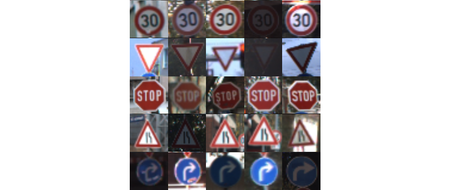
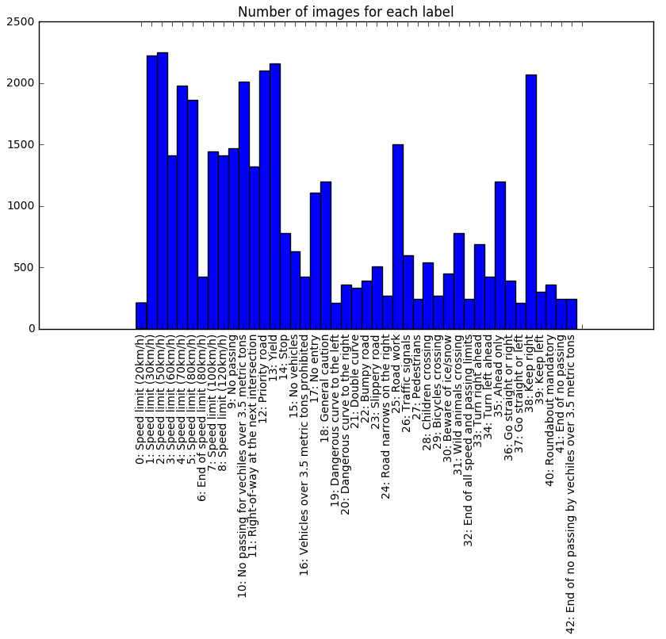
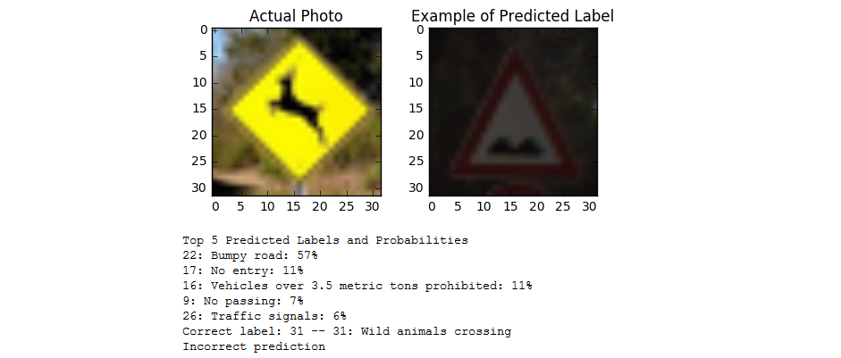

# Self Driving Car: Traffic Sign Classification
## Deep Learning with TensorFlow

### *Daniel Wolf*

## **Introduction**

Deep learning with TensorFlow can be used to train a neural network to 
label traffic sign images with high accuracy. In this project, I 
achieved **91.2%** test accuracy on the publicly available database of German
traffic signs ([link](http://benchmark.ini.rub.de/?section=gtsrb&subsection=dataset)).

Below you will find details on **Data Overview and Augmentation**,
**Model Architecture**, and **Testing and Performance**.

## **Data Overview and Augmentation**

The initial data set size is 39,209 in the training set and 12,630 in the testing set.
There are 43 different types of signs. Here is a random sampling of 5 types of signs
and a histogram showing the frequency of each sign type in the training data:

An 80-20 split on the training data would only leave 7,841 images for the validation data. 
A good rule of thumb for validation data set size is 30,000 images so that we can 
confidently measure changes to 0.01% accuracy. I therefore augmented the data by
creating 5 duplicates of each of the 39k training images with rotation, translation, 
and shear affine transformations. The final training set thus included 188,203 samples
and the validation set included 47,051 samples.

This approach maintained the same ratio of label types.
In some scenarios, it would be better to balance the data evenly across all labels,
but for the task at hand it makes the most sense to train more on the signs
that will be seen more often. I noticed the effect of this augmentation approach
on my training as it significantly reduced the gap between validation
and testing accuracy. In other words, the affine
transformations prevent overfitting to the training and validation images.

An example of how the image is duplicated and 
transformed is shown here:

I also applied one-hot encoding to the training labels so that the model could
handle several categorical variables (in this case, 43 different street sign 
types) using a binary feature approach. Normalization of the training images was 
not necessary since they are all on the same scale (0 to 255).

## **Model Architecture**

](images/architecture.png)

My approach to defining a convolutional neural network
was to leverage LeNet-5 architecture developed
by Yann LeCun. This is one of the original CNN architectures. It includes
two convolutional layers each followed by a max pooling layer and ReLU
activation. These layers are followed by a flattening layer and three
fully connected layers. The output of the final fully connected layer
is a binary vector of length 43, which corresponds to the traffic 
sign prediction. I also added dropout to my architecture so as to prevent overfitting.

More detail on Yann LeCun's approach to traffic sign
classification can be found in his
paper [here](http://yann.lecun.com/exdb/publis/pdf/sermanet-ijcnn-11.pdf).

## **Testing and Performance**

My validation accuracy is 94.8% and test accuracy is 91.2%. I inserted a
condition so that as soon as the validation accuracy reaches 95%, the training
stops. I found that this was the peak percentage reached so I did not 
want to overfit after reaching 95%.

I implemented a softmax probability function so that I could determine the model's
confidence in its prediction. Based on a random sampling of test images, 
it was virtually 100% confident in its correct prediction, which makes 
sense.

I also tested the model on new images that are not in the German dataset,
including an American stop sign and a wild animals crossing. The model
correctly identified each of these with 100% confidence. However, the wild animals sign
proved to be more of a challenge, because the German version looks quite 
different. In this case, my model predicted that it was a Bumpy road sign.
This might be related to how the bumps on the sign slightly resemble 
the deer on the wild animal sign. The model was only 57% confident in its
incorrect prediction as shown below. The model also suggested a No Entry
sign as being the second-most likely label.

## **Conclusion**

Implementing a convolutional neural network in TensorFlow provides more insight into 
the structure and functionality of a neural network than using a higher 
level implementation such as Keras. The downside is that it is more 
complex to code.

In order to improve upon the accuracy achieved thus far, there are a couple
approaches I could take. I could experiment with different model 
architectures such as adding another convolutional layer. Also, I am
interested in how trying different color spaces (such as YUV) could improve
performance.

#### Key Installations

* Python 3
* TensorFlow

*December 2016*

# SDC-Traffic-Sign-Classification
# SDC-Traffic-Sign-Classification
