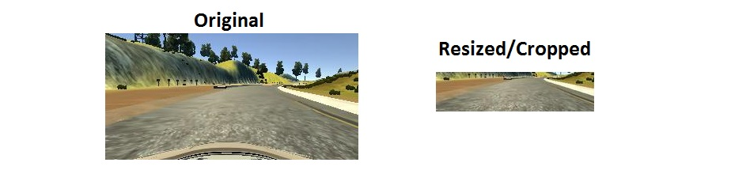
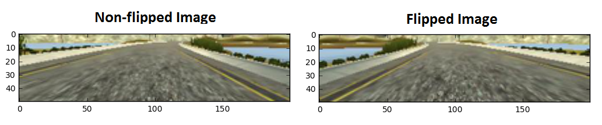
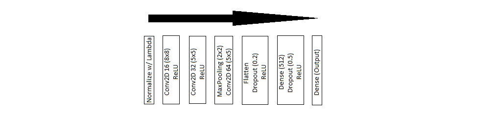

# Self Driving Car: Behavioral Cloning
## Deep Learning with Keras

### *Daniel Wolf*

## **Introduction**

Behavioral cloning with deep learning can be used to automate a self-driving car. 
You can see the final results of this project in my 
**[YouTube video](https://www.youtube.com/watch?v=8Oi2z_QhANA)**.

I started this project by gathering data. I used a driving simulator
to capture 10 images per second as I 
manually steered a car around a race track. These 
images are recorded along with the associated steering angle for each image. 
A neural network is then trained with Keras (TensorFlow 
backend) using the image data 
along with the steering angle as the label. Thus, the trained model can then be used 
to autonomously "drive" the car around the track by predicting the 
appropriate steering angle for each new image in front of the car.

Below you will find details on **Data Preprocessing**
and **Model Architecture**.

#### File Descriptions

* ```model.py```: Used for preprocessing and training with Keras
* ```data_prep.py```: Used for loading raw images and steering angles into pkl file
* ```drive.py```: Server for controlling the simulator using a
model architecture JSON and weights h5 file, which are outputs of ```model.py```
* The Windows 64-bit version of the driving simulator provided by Udacity can be found [here](https://d17h27t6h515a5.cloudfront.net/topher/2016/November/5831f3a4_simulator-windows-64/simulator-windows-64.zip)

## **Data Preprocessing**

#### 1) Resizing and cropping

The total dataset size is 24,108 images
([link to data](https://d17h27t6h515a5.cloudfront.net/topher/2016/December/584f6edd_data/data.zip)), 
which I split into training, validation, and testing datasets 
using a 60-20-20 breakdown with ```train_test_split()```.
I downsized all of my images from 160x320 to 100x200, which helps with 
processing time while keeping the same aspect ratio and 
not losing much valuable information. I also cropped out
the top 34 pixels and bottom 16 pixels, because this usually consisted of lakes, 
hills, trees, and the hood of the car, 
which are not useful for training in this context. The final image size
used is thus 50x200, which is similar to the image size of 66x200 used in the 
highly successful NVIDIA paper 
[End to End Learning for Self-Driving Cars](https://arxiv.org/pdf/1604.07316v1.pdf).




#### 2) The right turn

A challenging part of the project was training for the one right 
turn on the track. I duplicated the images associated with the right turn and 
added them several times over within the training data. 
This gave the neural network more images of the right turn for training.

#### 3) Horizontal flipping, shifting, shearing, and zoom

In order to prevent overfitting and improve model performance, I "flipped" every other 
image horizontally and multiplied the associated steering angle by -1. Example
shown below of a flipped image. Also, I utilized Keras ```ImageDataGenerator``` to 
make slight adjustments to the image data as it is fed into the neural network. These 
adjustments included width and height shifts, shearing, and zoom.
This helps augment our data by providing slightly different views and angles
in addition to the captured images.




## **Model Architecture**

After the preprocessing, I was ready to begin the deep learning training with Keras.

#### Architecture Definition




My approach to defining the model was to leverage the analysis done by Comma AI
as shown in their 
[open source code](https://github.com/commaai/research/blob/master/train_steering_model.py).
My implementation of the Comma AI model is shown in the diagram above. 
I used the same 3 convolutional layers along with a fully connected layer
before the output control layer.

The convolutional layers are designed to perform feature extraction and I kept the 
same parameters as were used by Comma AI. The 3 conv layers had filters of 32, 64, and 128
with kernel sizes of 8x8 for the first and 5x5 for the second and third layers. A 
stride of 4x4 was used for the first layer and 2x2 for the second and third.
The subsequent fully connected layers are designed to function as a controller for steering, and
the final FC layer outputs the steering angle. The dropout layers help prevent overfitting.

One key difference between my architecture and theirs is that I added a max pooling layer, 
which interestingly helped my autonomous car recognize one of the more difficult turns 
(by the dirt track after the bridge).

A second difference is that I used ReLU activation instead of ELU. I found
this made the steering angle predictions less jittery, so the car drove much more smoothly.

#### Regression vs Classification

Given that the steering angle is a continuous value, this is a regression 
problem. The loss function should be 
mean-squared error (MSE) to measure the difference between the predicted 
value and the steering angle label. The final fully connected "dense" layer provides
the predicted steering angle, and We do not need an activation function on the
this layer. 

#### Fit Generator / Evaluate Generator

Keras ```fit_generator``` and ```evaluate_generator``` allow image processing 
without needing to load them all into memory, which greatly improves the 
ability of the neural network to train on more data. I set the samples per 
epoch to the entire length of the dataset so that it utilizes all of the 
available data.

#### Training Parameters

Because I implemented an Adam Optimizer, I did not need to set many hyperparameters 
associated with the loss function. The Adam Optimizer is more robust, while 
SGD often needs significant fine tuning. I did find that my model converged more 
consistently by manually lowering the learning rate to 0.0001.

I used a batch size of 256 for 16 epochs. I found that optimum performance 
is reached after approximately this many epochs. 
MSE consistently improved with each epoch up until then. While I did notice 
that a better MSE did not necessarily mean better performance driving around 
the track, it still helped show that the model was converging and gave a 
general clue as to how the autonomous vehicle would perform on its own.

## **Conclusion**

At this point, my trained model and associated weights could "autonomously" drive 
around the provided test track with no issues!

For future work on this project, I would also like to test the effectiveness 
of transfer learning with VGG, 
AlexNet, or ResNet. Also, GoogLeNet may be effective for self-driving cars
since it is FAST and could help with near real-time automation. I did not 
implement transfer learning from the start because those models are much 
larger and have more parameters that need to be tuned for accomplishing
the task at hand.

#### Key Installations

* Python 3
* TensorFlow
* Keras

*December 2016*
